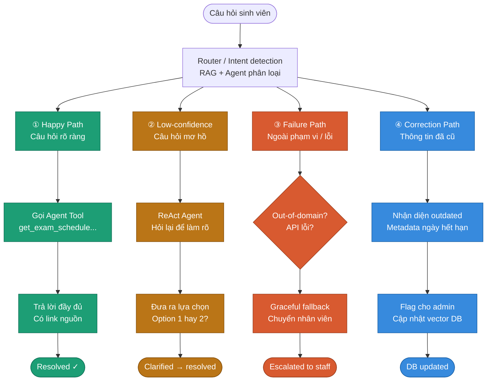

# SPEC draft — C401 -B2

## Track: Vinuni

## Problem statement: 

Sinh viên và phụ huynh thường gặp vướng mắc trong việc tìm hiểu các quy định, thủ tục hành chính, đăng ký tín chỉ hay điều kiện xét học bổng, xem lịch học, lịch thi, điểm số, ... Hiện tại, họ phải xem qua các tài liệu quy chế dài hoặc liên hệ trực tiếp phòng ban, mất nhiều thời gian do phải chờ phản hồi và tra cứu thủ công.

## 1. CANVAS DRAFT

### 1. VALUE — Giá Trị Cốt Lõi

#### User nào? Pain nào?

**Sinh viên:**
- Mệt mỏi với việc đăng nhập nhiều hệ thống cũ kỹ để xem điểm
- Lười đọc các file PDF quy chế dài hàng chục trang
- Hay quên lịch thi, lịch học

**Phụ huynh:**
- Thiếu thông tin về tình hình học tập của con
- Không nắm rõ các mốc thời gian đóng học phí hoặc quy định xét học bổng
- Gặp khó khăn khi tiếp cận các thuật ngữ đào tạo (tín chỉ, học phần tiên quyết,...)

#### Auto hay Aug?

> **Augmentation (Hỗ trợ):** AI đóng vai trò một *"Giao diện ngôn ngữ tự nhiên"* giúp trả lời nhanh. Những việc cần sự can thiệp của con người hoặc quyết định hành chính (ví dụ: phúc khảo điểm, đơn từ đặc biệt) sẽ được đẩy về phần **Fallback** để liên hệ trực tiếp phòng đào tạo.

#### Value khi AI đúng

| Lợi ích | Mô tả |
|---|---|
| Tiết kiệm thời gian | Chuyển đổi từ 5–10 phút tra cứu thủ công xuống còn ~5 giây hỏi-đáp |
| Giảm rào cản thông tin | Phụ huynh có thể đồng hành cùng con cái tốt hơn dựa trên dữ liệu thực tế |
| Sẵn sàng 24/7 | Giải đáp ngay lập tức kể cả vào ban đêm hoặc ngày nghỉ |

---

### 2. TRUST — Sự Tin Cậy & An Toàn

#### Precision hay Recall?

**→ Precision (Độ chính xác cao) là ưu tiên số 1.**

Trong giáo dục, thông tin sai (nhầm lịch thi, nhầm điểm) dẫn đến hậu quả nghiêm trọng. Hệ thống được thiết lập để ưu tiên luồng **Fallback** nếu độ tự tin *(confidence score)* của LLM Router thấp, thay vì cố gắng đưa ra một câu trả lời đoán mò.

#### Khi sai → User biết/sửa thế nào?

- **Citations (Trích dẫn):** Với câu hỏi về quy định (luồng RAG), AI phải hiển thị đoạn văn bản trích dẫn trực tiếp từ văn bản gốc.
- **Grounded:** Câu trả lời về điểm/lịch (luồng Agent) phải có dòng xác nhận: *"Dữ liệu được trích xuất trực tiếp từ hệ thống quản lý sinh viên lúc [Giờ:Ngày]"*.
- **Nút phản hồi:** Cung cấp tùy chọn *"Báo cáo thông tin sai lệch"* ngay tại mỗi câu trả lời.

#### Trust Recovery — Khôi phục niềm tin

Nếu phát hiện dữ liệu không khớp, hệ thống sẽ cung cấp **đường dây nóng** hoặc **email** của đơn vị quản lý dữ liệu gốc để người dùng phản ánh ngay lập tức.

---

### 3. FEASIBILITY — Tính Khả Thi Kỹ Thuật

#### Cost / Latency — Chi phí & Tốc độ

- **Chi phí:** Sử dụng mô hình **Hybrid**.
  - Các câu hỏi phân loại đơn giản dùng model nhỏ *(GPT-5.4-mini)*
  - Chỉ dùng model lớn cho các phân tích quy chế phức tạp
- **Tốc độ:** Mục tiêu phản hồi **dưới 3 giây**. Sử dụng **Streaming response** để người dùng thấy văn bản hiển thị ngay lập tức.

#### Dependency / Risk chính — Rủi ro & Phụ thuộc

| Rủi ro | Mô tả |
|---|---|
| API Connection | Phụ thuộc vào tính ổn định của API hệ thống quản lý điểm/lịch của nhà trường |
| Data Security *(Rủi ro lớn nhất)* | Cần cơ chế xác thực (ví dụ: mã OTP gửi về điện thoại sinh viên) khi phụ huynh muốn truy cập dữ liệu cá nhân của con |
| Vector Database | Tài liệu RAG cần được cập nhật ngay khi có quy định mới để tránh lỗi thời |

---

### 4. LEARNING SIGNAL — Tín Hiệu Cải Tiến

#### User sửa AI → Data đi vào đâu?

Mọi câu hỏi rơi vào ô **Fallback (Ngoài phạm vi)** sẽ được lưu vào một *"Inbox chờ xử lý"*. Đội ngũ phát triển sẽ xem xét để:
- Bổ sung dữ liệu vào RAG
- Viết thêm Function Calling cho Agent tools

#### Đang tốt lên hay tệ đi?

Đo lường bằng hai chỉ số chính:

1. **Deflection Rate:** Tỷ lệ câu hỏi AI giải quyết được mà người dùng không cần phải hỏi tiếp lên trang fanpage trường hoặc gọi hotline.
2. **CSAT (Tỷ lệ hài lòng):** Thu thập sau mỗi phiên chat.

#### Càng nhiều data càng tốt?

**Phân tích hành vi:** Thu thập các cụm từ địa phương hoặc cách diễn đạt không chính thống của phụ huynh để tối ưu hóa **LLM Router**, giúp nó nhận diện ý định *(intent)* chính xác hơn qua từng ngày.


## 2. User Stories — 4 Luồng Xử Lý


 

### 1. Happy Path — Luồng Thuận Lợi

**Mô tả:** Người dùng đặt câu hỏi rõ ràng, cung cấp đủ thông tin. Hệ thống hiểu đúng mục đích, định tuyến đúng nhánh và trả về kết quả chính xác.

**User Story:**
> "Sinh viên muốn tra cứu lịch thi môn học để biết ngày giờ và phòng thi chính xác."

**Ví dụ tương tác:**

```
User: "Cho mình hỏi lịch thi môn Cấu trúc dữ liệu kỳ này.
       Mã SV của mình: 2021xxxx."

Router: Xác định Intent = Tra cứu cá nhân
        → Gọi Agent Tool: get_exam_schedule

Bot: "Chào bạn, lịch thi môn Cấu trúc dữ liệu của mã SV 2021xxxx
     là vào 08:00 sáng ngày 25/12, tại phòng A3-102 nhé."
```

**Kết quả kỳ vọng:**
- Rút trích đúng thực thể (Mã sinh viên, Tên môn)
- Gọi API thành công, hiển thị đầy đủ thông tin

---

### 2. Low-confidence Path — Luồng Cần Làm Rõ
**Mô tả:** Người dùng hỏi nhập nhằng, không rõ ràng, hoặc RAG có thể truy xuất ra các tài liệu có confidence score trung bình. Thay vì phán đoán bừa, bot cần hỏi lại để làm rõ.

**User Story:**
> "Giả sử  sinh viên muốn biết thủ tục làm lại thẻ, nhưng cách sinh viên dùng từ không rõ ràng"

**Ví dụ tương tác:**

```
User: "chỉ mình cách làm lại thẻ ùi á"

RAG: Retrieve được 2 kết quả tương đương:
     [1] Làm lại thẻ sinh viên
     [2] Làm lại thẻ thư viện

Bot: "Chào bạn, bạn đang muốn hỏi về:
     [1] Thủ tục cấp lại Thẻ sinh viên
     [2] Cấp lại Thẻ thư viện

     Nếu là thẻ sinh viên, bạn mang ảnh 3×4 + CCCD photo lên
     phòng Công tác sinh viên (khu A) nhé!"
```

**Kết quả kỳ vọng:**
- RAG không bị hallucination.
- Cung cấp option trực quan cho người dùng lựa chọn. Khi đã có lựa chọn, tiếp tục xử lý bình thường như Happy Path

---

### 3. Failure Path — Luồng Thất Bại / Out-of-domain

**Mô tả:** Khi yêu cầu vượt quá phạm vi hệ thống hoặc backend API lỗi. Cần thiết lập cho Bot xử lý "duyên dáng" (graceful degradation) — tránh bịa kết quả, luôn cung cấp lối thoát có ích.

**3 tình huống cụ thể:**

| Tình huống | Ví dụ | Phản hồi của bot |
|---|---|---|
| **Out-of-domain** | Hỏi chuyện chính trị, đời tư giảng viên | Từ chối lịch sự, gợi ý lại phạm vi hỗ trợ |
| **API/Backend lỗi** | Tra điểm hoặc lịch thi bị timeout | Thông báo lỗi + cung cấp link cổng sinh viên |
| **Câu hỏi bảo mật** | SV A hỏi thông tin của SV B | Từ chối, giải thích lý do, không leo thang |

**Ví dụ tương tác (API lỗi):**

```
User: "Điểm môn Giải tích của mình là bao nhiêu?"

Backend: Timeout / Connection error

Bot: "Hệ thống tra cứu đang bận, bạn thử lại sau ít phút nhé.
     Hoặc kiểm tra trực tiếp tại: portal.truong.edu.vn
     Hotline hỗ trợ: (028) xxx-xxxx"
```

**Kết quả kỳ vọng::** Mọi failure được định nghĩa như 3 tình huống cụ thể phía trên đều cần kết thúc bằng **một lối thoát có ích**, không bao giờ đưa ra những câu trả lời khiến người dùng khó chịu.

---

### 4. Correction Path — Luồng Sửa Thông Tin Cũ

**Mô tả:** Bot nhận diện tài liệu đã hết hiệu lực (dựa trên metadata ngày hết hạn trong vector DB), tự động flag cho admin và vẫn cung cấp thông tin tốt nhất hiện có.

**Ví dụ tương tác:**

```
User: "Hạn nộp học phí học kỳ này là khi nào?"

RAG: Tìm thấy tài liệu, metadata: expires = "2023-12-31" ← đã hết hạn

Bot: "Theo thông báo cũ, hạn nộp học phí thường vào tuần 2 sau
khai giảng. Tuy nhiên thông tin này có thể đã cập nhật —
     bạn vui lòng kiểm tra tại: thongbao.truong.edu.vn
     để có thông tin chính xác nhất nhé."

System (ngầm): Flag tài liệu → gửi alert cho Admin → Admin
               cập nhật tài liệu mới vào vector DB
```

**Giá trị:** Bot không chỉ tra cứu thụ động mà còn là **hệ thống kiểm soát chất lượng tài liệu chủ động**.

---
## 3. Bảng tóm tắt tiêu chí đánh giá chung (Eval Metrics)

| Tiêu chí đánh giá | Ngưỡng đạt | Cách đo lường | Lý do quan trọng nhất | Liên quan đến cờ đỏ |
| :--- | :--- | :--- | :--- | :--- |
| 1. Độ chính xác thông tin | ≥ 98,5% | So sánh với tài liệu chính thức của nhà trường | Tránh sai sót về quy định, lịch thi, hạn nộp gây thiệt hại cho sinh viên | Sai lịch thi, bịa thông tin, sai hạn nộp |
| 2. Độ đầy đủ thông tin | ≥ 96% | Chấm theo từng yếu tố cần có (bước thủ tục, giấy tờ, cách tra cứu…) | Đảm bảo sinh viên và phụ huynh có đủ thông tin để hành động | Thiếu bước thủ tục hoặc cách tra cứu lịch |
| 3. Độ rõ ràng và thân thiện | ≥ 4,6 / 5,0 | Chấm thang điểm 1-5 bởi sinh viên và phụ huynh | Giúp sinh viên năm nhất và phụ huynh dễ hiểu và dễ làm theo | Hướng dẫn mơ hồ, không có nhắc nhở kiểm tra |

### Giải thích ngắn gọn về các ngưỡng đạt

**1. Độ chính xác thông tin ≥ 98,5%**  
Ngưỡng cao vì đây là thông tin hành chính và học vụ. Sai chỉ 1-2% cũng có thể khiến sinh viên bỏ lỡ hạn đăng ký tín chỉ, thi sai lịch hoặc mất học bổng. Phải gần như tuyệt đối chính xác để bảo vệ quyền lợi người dùng và uy tín nhà trường.

**2. Độ đầy đủ thông tin ≥ 96%**  
Ngưỡng này đảm bảo AI không trả lời nửa vời. Sinh viên và phụ huynh thường không biết phải hỏi gì thêm, nên AI phải đưa đủ bước, giấy tờ, hạn chót. Thiếu sót sẽ làm người dùng vẫn phải tự đi hỏi lại.

**3. Độ rõ ràng và thân thiện ≥ 4,6 / 5,0**  
Ngưỡng cao vì đối tượng có cả phụ huynh lớn tuổi và sinh viên mới. Thông tin phải dễ đọc, có cấu trúc rõ ràng và hướng dẫn cụ thể (đặc biệt cách tra cứu trên cổng thông tin). Nếu dưới 4,6, người dùng dễ bỏ cuộc hoặc hiểu sai.

### Gợi ý sử dụng chung
- Cả 3 tiêu chí phải đạt ngưỡng thì mới triển khai AI chính thức.  
- Bất kỳ câu trả lời nào rơi vào **cờ đỏ** đều phải xử lý ngay dù các tiêu chí khác có đạt.

## 4. Top 3 Failure Modes

| STT | Trigger (Nguyên nhân) | Hậu quả (Impact) | Mitigation (Giải pháp khắc phục) |
| :-- | :--- | :--- | :--- |
| 1 | **Hallucination (Ảo giác AI):** User hỏi về một quy định không có trong data (ví dụ: học bổng ngoại lệ) nhưng AI tự "chế" ra điều kiện. | Sinh viên làm sai thủ tục, lỡ hạn nộp hồ sơ hoặc khiếu nại nhà trường vì tin lời chatbot. | Thiết lập **Knowledge-base RAG** chặt chẽ; Prompt quy định: "Nếu không có trong tài liệu, tuyệt đối nói không biết và dẫn link tới phòng công tác SV". |
| 2 | **Cập nhật dữ liệu trễ (Outdated info):** Quy định đăng ký tín chỉ vừa thay đổi sáng nay, nhưng AI vẫn dùng data cũ của kỳ trước. | User đăng ký sai lịch, gây nghẽn hệ thống hoặc mất quyền lợi đăng ký môn học. | Gắn **Timestamp** vào mỗi đoạn dữ liệu; Hiển thị câu cảnh báo: "Thông tin này cập nhật lần cuối vào ngày...". Ưu tiên lấy data từ API trực tiếp nếu có thể. |
| 3 | **Sai lệch ngữ cảnh (Context ambiguity):** User hỏi chung chung "Khi nào nộp hồ sơ?" mà không nói rõ là hồ sơ học bổng hay hồ sơ nhập học. | AI đưa ra quy trình của loại hồ sơ khác, dẫn đến nhầm lẫn tai hại cho phụ huynh/sinh viên. | Chatbot phải thực hiện **Clarification question**: "Bạn đang muốn hỏi về hồ sơ học bổng hay hồ sơ đăng ký tín chỉ?". Không trả lời ngay khi độ tự tin (confidence score) thấp. |

## 5. ROI – Chatbot Hỗ trợ Sinh viên VinUni

### ROI Table

| | Conservative | Realistic | Optimistic |
| :--- | :--- | :--- | :--- |
| **Assumption** | 600 SV, 40% dùng (~240 user) | 800 SV, 60% dùng (~480 user) | 800 SV, 80% dùng (~640 user) |
| **Cost** | ~$30/ngày (API + infra cơ bản) | ~$70/ngày | ~$150/ngày (có integration hệ thống) |
| **Benefit** | Mỗi user tiết kiệm 12 phút/ngày → ~48 giờ/ngày | ~96 giờ/ngày | ~128 giờ/ngày |
| **Net** | (giả định là 5$/1h) ~$240 – $30 = **+$210/ngày** | ~$480 – $70 = **+$410/ngày** | ~$640 – $150 = **+$490/ngày** |

### Kill Criteria

- <40% sinh viên sử dụng sau 2 tháng  
- Sinh viên vẫn ưu tiên hỏi trực tiếp advisor  
- AI trả sai thông tin quan trọng (deadline, học phí, học bổng)

---

## 6. Mini AI Spec: VIN-Admin Assistant (VAA)

### 1. Tầm nhìn sản phẩm (Vision)

Xây dựng một **"Văn phòng một cửa ảo"** giúp sinh viên và phụ huynh giải quyết tức thời các thắc mắc về thủ tục hành chính, quy định đào tạo và tra cứu trạng thái cá nhân (lịch học, điểm, học phí) với độ tin cậy tuyệt đối dựa trên dữ liệu nội bộ.

### 2. Sơ đồ luồng xử lý (Architecture via LangGraph)

Hệ thống được thiết kế dưới dạng một **State Machine (Máy trạng thái)** sử dụng LangGraph để điều phối luồng công việc.

#### Node 1 — LLM Router
Sử dụng mô hình AI để phân loại ý định người dùng.

- **Ví dụ:** "Điều kiện nhận học bổng là gì?" → Điều hướng sang **RAG**
- **Ví dụ:** "Ngày mai tôi học phòng nào?" → Điều hướng sang **Agent Tools**

#### Node 2 — RAG (Knowledge Retrieval)
Truy xuất thông tin từ kho tài liệu nội bộ (PDF quy định, sổ tay sinh viên, hướng dẫn học bổng). AI sẽ tìm kiếm các đoạn văn bản liên quan nhất để trả lời.

#### Node 3 — Agent Tools (Function Calling)
Thực thi các hàm nghiệp vụ để lấy dữ liệu thực tế từ hệ thống:

| Hàm | Chức năng |
| :--- | :--- |
| `get_schedule()` | Kiểm tra lịch học |
| `get_exam_schedule()` | Kiểm tra lịch thi |
| `get_tuition_status()` | Kiểm tra tình trạng đóng học phí |
| `get_grades()` | Tra cứu điểm số cá nhân |

#### Node 4 — Fallback
Xử lý các trường hợp ngoài phạm vi hoặc yêu cầu nhạy cảm bằng cách cung cấp thông tin liên hệ của phòng ban chuyên trách (Hotline/Email).

## Phân công
- Lê Thành Long: AI Product Canvas
- Đỗ Xuân Bằng: Mini AI Spec
- Trương Anh Long: ROI 
- Lã Thị Linh: Failure Path
- Nguyễn Huy Hoàng: User Stories x 4 Path
- Đỗ Việt Anh: Eval Metrics